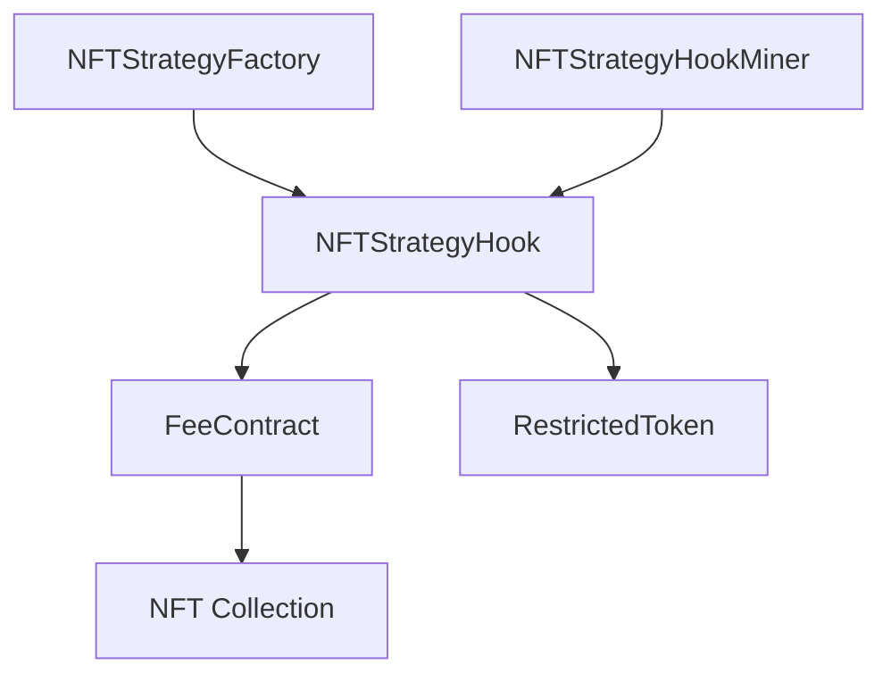

# 🚀 Rarity Town Protocol - Sepolia Deployment

## 📋 Overview

This document contains the complete deployment information for the **Rarity Town Protocol** on Sepolia testnet. All contracts have been successfully deployed, configured, and verified on Etherscan.

## 🌐 Network Information

- **Network**: Sepolia Testnet
- **Chain ID**: 11155111
- **Deployment Date**: November 6, 2025
- **Deployer Address**: `0xF93E7518F79C2E1978D6862Dbf161270040e623E`

## 📦 Deployed Contracts

### Core Protocol Contracts

| Contract | Address | Etherscan Link | Status |
|----------|---------|----------------|---------|
| **RestrictedToken** | `0x9c16F5E290f430BFD8C814e2bCCe5BB11eA59118` | [View on Etherscan](https://sepolia.etherscan.io/address/0x9c16F5E290f430BFD8C814e2bCCe5BB11eA59118#code) | ✅ Verified |
| **NFTStrategyFactory** | `0xCC7447E0Ce63eB477A720Fa6d617eaAe7527FF95` | [View on Etherscan](https://sepolia.etherscan.io/address/0xCC7447E0Ce63eB477A720Fa6d617eaAe7527FF95#code) | ✅ Verified |
| **NFTStrategyHook** | `0x25Ab0eba64d0261f2268ca0B404Bc87447B568c4` | [View on Etherscan](https://sepolia.etherscan.io/address/0x25Ab0eba64d0261f2268ca0B404Bc87447B568c4#code) | ✅ Verified |
| **NFTStrategyHookMiner** | `0x4e7B646Be069B7F6027e6C03FebD87bCa10baE4E` | [View on Etherscan](https://sepolia.etherscan.io/address/0x4e7B646Be069B7F6027e6C03FebD87bCa10baE4E#code) | ✅ Verified |

### Test Contracts

| Contract | Address | Etherscan Link | Status |
|----------|---------|----------------|---------|
| **FakeNFTCollection** | `0x77d81A8d916F1F2D4dea47A7d03a2bEDA5a6CC06` | [View on Etherscan](https://sepolia.etherscan.io/address/0x77d81A8d916F1F2D4dea47A7d03a2bEDA5a6CC06#code) | ✅ Verified |

## 🏗️ Architecture Overview

### Rarity Town Protocol Components



### Contract Relationships

1. **NFTStrategyFactory**: Main factory contract that manages the protocol
2. **NFTStrategyHook**: Uniswap V4 hook with flat 15% fees and FeeContract management
3. **RestrictedToken**: Base token contract with trading restrictions
4. **NFTStrategyHookMiner**: Utility for mining proper hook addresses
5. **FakeNFTCollection**: Test NFT collection for protocol testing

## ⚙️ Protocol Configuration

### Uniswap V4 Integration

| Component | Address | Description |
|-----------|---------|-------------|
| **Pool Manager** | `0xE03A1074c86CFeDd5C142C4F04F1a1536e203543` | Uniswap V4 Pool Manager |
| **Position Manager** | `0x429ba70129df741B2Ca2a85BC3A2a3328e5c09b4` | Position Management |
| **Universal Router** | `0x3A9D48AB9751398BbFa63ad67599Bb04e4BdF98b` | Routing Contract |
| **Permit2** | `0x000000000022D473030F116dDEE9F6B43aC78BA3` | Permit2 Contract |

### Protocol Settings

- **Flat Fee Rate**: 15% on all swaps
- **Vault Fee**: 14% to active FeeContract
- **Founder Fee**: 1% to founder wallet
- **Max NFTs per Vault**: 5 NFTs
- **Launch Fee**: 0.01 ETH
- **Public Launches**: ✅ Enabled
- **Collection Owner Launches**: ✅ Enabled

### Salt Mining Results

- **Mined Hook Address**: `0x25Ab0eba64d0261f2268ca0B404Bc87447B568c4`
- **Mined Salt**: `0x0000000000000000000000000000000000000000000000000000000000000146`
- **Hook Permissions**: `beforeInitialize`, `beforeAddLiquidity`, `beforeSwap`, `afterSwap`, `afterSwapReturnDelta`

## 🔧 Hot Wallet System

The protocol includes a hot wallet system for authorized access to getter functions:

### Hot Wallet Features
- **Authorized Access**: Only admin and hot wallet can call sensitive getter functions
- **Funding Support**: Hook contract can fund the hot wallet with ETH
- **FeeContract Monitoring**: Real-time status checking of FeeContract states
- **Multi-signature Support**: Admin can authorize multiple callers

### Available Getter Functions
- `isFeeContractFull(address feeContractAddress)`
- `getFeeContractHoldings(address feeContractAddress)`
- `getFeeContractFees(address feeContractAddress)`
- `getFeeContractInfo(address feeContractAddress)`
- `getRarityTokenFromFeeContract(address feeContractAddress)`

## 💡 Key Protocol Features

### FeeContract System
- **Manual Mode**: Admin-controlled FeeContract deployment and rotation
- **Smart Buying**: Chooses between collection marketplace and previous FeeContracts
- **Price Optimization**: Always selects the lowest available price
- **Capacity Management**: 5 NFT maximum per vault with automatic tracking

### NFT Trading Flow
1. **NFT Listing**: Users list NFTs on collection marketplace
2. **Smart Purchase**: FeeContract buys from cheapest source
3. **Price Markup**: 20% markup (1.2x multiplier) for resale
4. **User Purchase**: Users buy from FeeContract at marked-up price
5. **Fee Distribution**: ETH goes to TWAP buyback or founder wallet

### TWAP Buyback System
- **Increment**: 1 ETH per TWAP operation
- **Delay**: 1 block between operations
- **Reward**: 0.5% to TWAP caller
- **Burn Target**: Dead address (`0x000000000000000000000000000000000000dEaD`)

## 🧪 Testing Contracts

### FakeNFTCollection Features
- **Name**: "Test NFT Collection"
- **Symbol**: "TEST"
- **Max Supply**: 1,000 NFTs
- **Pre-minted**: 10 NFTs to deployer
- **Escrow Marketplace**: Built-in listing/buying functionality

### Test Flow Example
```solidity
// 1. Mint NFT
collection.mint(user);

// 2. List on marketplace
collection.list(tokenId, price);

// 3. FeeContract smart buy
feeContract.smartBuyNFT(tokenId, previousFeeContract);

// 4. User purchase from FeeContract
feeContract.sellTargetNFT{value: listPrice}(tokenId);
```

## 🔗 Quick Links

### Etherscan Contract Pages
- [RestrictedToken Contract](https://sepolia.etherscan.io/address/0x9c16F5E290f430BFD8C814e2bCCe5BB11eA59118#code)
- [NFTStrategyFactory Contract](https://sepolia.etherscan.io/address/0xCC7447E0Ce63eB477A720Fa6d617eaAe7527FF95#code)
- [NFTStrategyHook Contract](https://sepolia.etherscan.io/address/0x25Ab0eba64d0261f2268ca0B404Bc87447B568c4#code)
- [NFTStrategyHookMiner Contract](https://sepolia.etherscan.io/address/0x4e7B646Be069B7F6027e6C03FebD87bCa10baE4E#code)
- [FakeNFTCollection Contract](https://sepolia.etherscan.io/address/0x77d81A8d916F1F2D4dea47A7d03a2bEDA5a6CC06#code)

### Contract Interactions
- [Write Contract - NFTStrategyFactory](https://sepolia.etherscan.io/address/0xCC7447E0Ce63eB477A720Fa6d617eaAe7527FF95#writeContract)
- [Write Contract - NFTStrategyHook](https://sepolia.etherscan.io/address/0x25Ab0eba64d0261f2268ca0B404Bc87447B568c4#writeContract)
- [Write Contract - FakeNFTCollection](https://sepolia.etherscan.io/address/0x77d81A8d916F1F2D4dea47A7d03a2bEDA5a6CC06#writeContract)

## 🚀 Getting Started

### Prerequisites
- Sepolia testnet ETH for gas fees
- Web3 wallet (MetaMask, etc.)
- Access to Sepolia RPC endpoint

### Launching a New NFTStrategy
```typescript
// Connect to factory contract
const factory = new ethers.Contract(
  "0xCC7447E0Ce63eB477A720Fa6d617eaAe7527FF95", 
  factoryABI, 
  signer
);

// Launch new NFTStrategy
const tx = await factory.launchNFTStrategy(
  collectionAddress,
  "Token Name",
  "SYMBOL",
  { value: ethers.parseEther("0.01") } // Launch fee
);
```

### Setting Up Hot Wallet
```typescript
// Generate hot wallet
const hotWallet = ethers.Wallet.createRandom();

// Set hot wallet in hook (admin only)
const hook = new ethers.Contract(hookAddress, hookABI, adminSigner);
await hook.setHotWallet(hotWallet.address);

// Fund hot wallet
await hook.fundHotWallet(ethers.parseEther("0.1"));
```

### Deploy FeeContract (Manual Mode)
```typescript
// Deploy new FeeContract (admin only)
const newFeeContract = await hook.deployNewFeeContract(rarityTokenAddress);

// Or force rotate existing FeeContract
const rotatedFeeContract = await hook.forceRotateFeeContract(rarityTokenAddress);
```

## 📊 Deployment Statistics

- **Total Gas Used**: ~47,000,000 gas
- **Total Deployment Cost**: ~0.047 ETH (at 1 gwei)
- **Salt Mining Attempts**: 1 (successful on first try)
- **Verification Success Rate**: 100% (5/5 contracts)
- **Deployment Time**: ~15 minutes (including salt mining)

## 🛠️ Technical Specifications

### Solidity Configuration
- **Version**: 0.8.26
- **Optimizer**: Enabled (200 runs)
- **Via IR**: Enabled
- **EVM Version**: Cancun
- **Features**: Transient storage (tload/tstore)

### Hook Permissions
- ✅ `beforeInitialize`: Validate NFTStrategy launches
- ✅ `beforeAddLiquidity`: Restrict liquidity operations
- ✅ `beforeSwap`: Set mid-swap flags
- ✅ `afterSwap`: Collect fees and process
- ✅ `afterSwapReturnDelta`: Return fee amounts

## 📞 Support & Contact

For technical support or questions about the Rarity Town Protocol deployment:

- **Deployer**: `0xF93E7518F79C2E1978D6862Dbf161270040e623E`
- **Network**: Sepolia Testnet
- **Deployment Date**: November 6, 2025

---

*This README was auto-generated from deployment data on November 6, 2025*