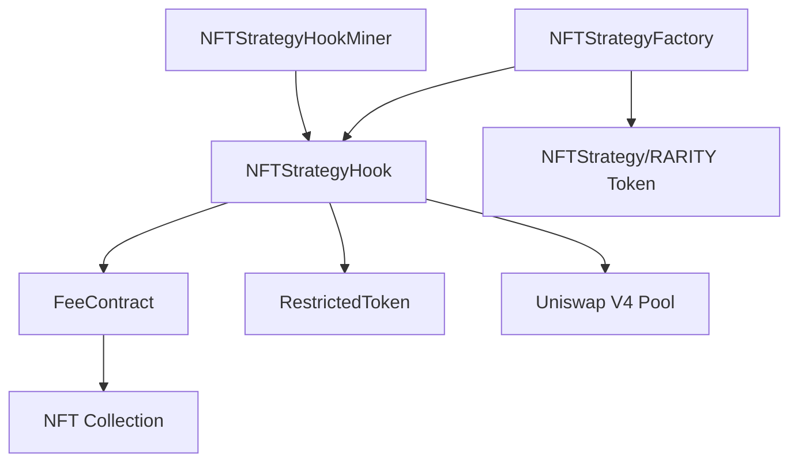

# 🚀 Rarity Town Protocol

## 📋 Overview

The **Rarity Town Protocol** is a decentralized protocol that creates ERC20 tokens (RARITY tokens) representing NFT collection strategies. Each RARITY token is paired with its underlying NFT collection and traded on Uniswap V4, with a sophisticated fee system that funds NFT vaults, enables buyback-and-burn mechanisms, and supports NFT trading through FeeContracts.

## 🌐 Latest Deployment - Base Mainnet

The protocol is currently deployed and verified on **Base Mainnet** with all contracts active and handling swaps with fees.

### Deployed Contracts

| Contract | Address | BaseScan Link | Status |
|----------|---------|---------------|---------|
| **NFTStrategyFactory** | `0xb35de559B8dF1237bc9324e4eD57e586F37d4bED` | [View on BaseScan](https://basescan.org/address/0xb35de559B8dF1237bc9324e4eD57e586F37d4bED#code) | ✅ Verified |
| **NFTStrategyHook** | `0xe6951fD58448c11b937c2cd823f6240a068B68c4` | [View on BaseScan](https://basescan.org/address/0xe6951fD58448c11b937c2cd823f6240a068B68c4#code) | ✅ Verified |
| **NFTStrategy (RARITY Token)** | `0x908dd2FbbbA92A5EAAeab5D8182e7269ae39461A` | [View on BaseScan](https://basescan.org/address/0x908dd2FbbbA92A5EAAeab5D8182e7269ae39461A#code) | ✅ Verified |
| **FeeContract** | `0x38ecdfabec59d12f3bdd120b36d4f0d6fc295fe3` | [View on BaseScan](https://basescan.org/address/0x38ecdfabec59d12f3bdd120b36d4f0d6fc295fe3#readContract) | ✅ Verified |
| **NFTStrategyHookMiner** | `0x25a4BA1D9B9018c954C82463348d20aC981C0217` | [View on BaseScan](https://basescan.org/address/0x25a4BA1D9B9018c954C82463348d20aC981C0217#code) | ✅ Verified |
| **OpenSeaNFTBuyer** | `0x69bC1a1DeAC31D425EF5707864490273e4378492` | [View on BaseScan](https://basescan.org/address/0x69bC1a1DeAC31D425EF5707864490273e4378492#code) | ✅ Verified |
| **RestrictedToken** | `0xc7B391b5B2bE18606a3023535062fD59be096Bdc` | [View on BaseScan](https://basescan.org/address/0xc7B391b5B2bE18606a3023535062fD59be096Bdc#code) | ✅ Verified |

### Network Information

- **Network**: Base Mainnet
- **Chain ID**: 8453
- **Status**: ✅ All contracts verified and operational
- **Fee System**: ✅ Active (15% flat fee on all swaps)
- **Swap Status**: ✅ Swaps working with fees collected

### Uniswap V4 Integration on Base

The protocol is fully integrated with Uniswap V4 on Base Mainnet. Users can swap ETH for RARITY tokens directly through Uniswap's interface, with the hook automatically collecting and distributing fees.


*Example swap interface showing RARITY token (RT) trading on Uniswap V4 with fee collection (15% fee shown in the transaction details)*

### Quick Links

- **Factory Contract**: [View on BaseScan](https://basescan.org/address/0xb35de559B8dF1237bc9324e4eD57e586F37d4bED#code)
- **Hook Contract**: [View on BaseScan](https://basescan.org/address/0xe6951fD58448c11b937c2cd823f6240a068B68c4#code)
- **RARITY Token**: [View on BaseScan](https://basescan.org/address/0x908dd2FbbbA92A5EAAeab5D8182e7269ae39461A#code)
- **FeeContract**: [View on BaseScan](https://basescan.org/address/0x38ecdfabec59d12f3bdd120b36d4f0d6fc295fe3#readContract)
- **RestrictedToken**: [View on BaseScan](https://basescan.org/address/0xc7B391b5B2bE18606a3023535062fD59be096Bdc#code)

## 🏗️ Architecture Overview

### Protocol Components



### Contract Relationships

1. **NFTStrategyFactory**: Main factory contract that deploys and manages RARITY tokens
2. **NFTStrategyHook**: Uniswap V4 hook that enforces fees and manages fee distribution
3. **NFTStrategy (RARITY Token)**: ERC20 token representing a collection strategy
4. **FeeContract**: Vault contract that holds NFTs, receives fees, and executes buyback/burn
5. **RestrictedToken**: Base ERC20 with whitelist-based transfer restrictions
6. **NFTStrategyHookMiner**: Utility for deterministic hook address mining via CREATE2
7. **OpenSeaNFTBuyer**: Helper contract for purchasing NFTs from OpenSea via Seaport

## 📦 Core Contracts

### NFTStrategyFactory

**Role**: Deploys RARITY tokens, manages protocol configuration, seeds liquidity, and handles TWAP operations.

**Key Features**:
- Deploys new `NFTStrategy` (RARITY) tokens for NFT collections
- Seeds initial liquidity into Uniswap V4 pools
- Manages launch permissions (public launches, collection owner launches)
- Enforces router restrictions and transfer validation
- Handles TWAP (Time-Weighted Average Price) buyback operations for RestrictedToken
- Gates liquidity loading to prevent unauthorized pool initialization

**Key Functions**:
- `launchNFTStrategy(collection, tokenName, tokenSymbol)`: Deploys a new RARITY token, creates Uniswap V4 pool, seeds liquidity, and performs initial purchase
- `ownerLaunchNFTStrategy(...)`: Owner-only launch function
- `processTokenTwap()`: Executes buyback-and-burn of RestrictedToken with caller reward
- `validTransfer(from, to, tokenAddress)`: Validates transfers for RARITY tokens

**State Variables**:
- `loadingLiquidity`: Flag that gates pool initialization and liquidity additions
- `deployerBuying`: Flag indicating factory-initiated token purchases
- `routerRestrict`: Controls transfer restrictions
- `listOfRouters`: Whitelist of authorized router addresses
- `feeToLaunch`: Launch fee required to create new strategies
- `publicLaunches`: Whether public users can launch strategies
- `collectionOwnerLaunches`: Whether collection owners can launch strategies
- `twapIncrement`: Amount of ETH to use per TWAP operation (default: 1 ETH)
- `twapDelayInBlocks`: Minimum blocks between TWAP operations (default: 1)

**Launch Flow**:
1. User calls `launchNFTStrategy()` with collection address, token name, and symbol
2. Factory validates collection is ERC721 and checks launch permissions
3. Factory deploys new `NFTStrategy` contract (mints MAX_SUPPLY to factory)
4. Factory sets `loadingLiquidity = true` and initializes Uniswap V4 pool
5. Factory adds initial liquidity (1 wei ETH : MAX_SUPPLY tokens)
6. Factory calls hook to set fee address for the new RARITY token
7. Factory performs initial purchase (0.01 ETH) to make token appear on Uniswap UI
8. Factory sets `loadingLiquidity = false`
9. Excess ETH (after launch fee) is sent to fee address

### NFTStrategy (RARITY Token)

**Role**: ERC20 token representing an NFT collection strategy. Non-transferable between EOAs, but tradeable via Uniswap V4 DEX.

**Key Features**:
- Maximum supply: 1,000,000,000 tokens (1 billion)
- All tokens minted to factory at deployment
- Transfer restrictions enforced via Factory's `validTransfer()` logic
- Mid-swap flag prevents unauthorized transfers during swaps
- Legacy NFT trading functions disabled (moved to FeeContract)
- Legacy fee collection disabled (moved to FeeContract)

**Transfer Restrictions**:
- Transfers allowed only through whitelisted routers (Uniswap V4 flow)
- Direct EOA-to-EOA transfers are blocked
- During swaps, `midSwap` flag is set to prevent sandwich attacks
- Factory's `validTransfer()` enforces routing through authorized contracts

**State Variables**:
- `priceMultiplier`: Multiplier for NFT sale prices (default: 1200 = 20% markup)
- `midSwap`: Flag set by hook during swap operations
- `MAX_SUPPLY`: Maximum token supply (1 billion)
- `DEADADDRESS`: Address for token burns (0x...dEaD)

**Key Functions**:
- `setMidSwap(bool value)`: Called by hook to set mid-swap flag
- `updateName(string)`: Factory can update token name
- `updateSymbol(string)`: Factory can update token symbol
- `setPriceMultiplier(uint256)`: Factory can update price multiplier

### NFTStrategyHook

**Role**: Uniswap V4 hook that enforces 15% flat fee on all swaps, converts fees to ETH, and distributes to FeeContract and founder wallet.

**Key Features**:
- **Flat Fee**: 15% on all swaps (buy and sell)
- **Fee Distribution**: 14% to active FeeContract, 1% to founder wallet
- **Fee Conversion**: Automatically swaps non-ETH fees to ETH
- **Mid-Swap Protection**: Sets `midSwap` flag on RARITY tokens during swaps
- **Liquidity Gating**: Only allows liquidity operations during `loadingLiquidity`
- **Manual FeeContract Management**: Admin deploys and rotates FeeContracts manually

**Hook Permissions**:
- ✅ `beforeInitialize`: Validates pool initialization (only during liquidity loading)
- ✅ `beforeAddLiquidity`: Gates liquidity additions (only during liquidity loading)
- ✅ `beforeSwap`: Sets mid-swap flags on RARITY tokens
- ✅ `afterSwap`: Collects fees, converts to ETH, and distributes
- ✅ `afterSwapReturnDelta`: Returns fee amounts to pool manager
- ❌ All donate and remove-liquidity hooks disabled

**Fee Processing Flow**:
1. Hook calculates 15% fee from swap amount
2. Hook takes fee from pool manager
3. If fee is not in ETH, hook swaps fee token to ETH
4. Hook splits fee: 14% to active FeeContract, 1% to founder
5. If no FeeContract exists, entire 15% goes to founder
6. Hook emits `HookFee` event with fee details

**State Variables**:
- `FLAT_FEE`: 1500 (15% in basis points)
- `VAULT_FEE_PORTION`: 1400 (14% to vault)
- `FOUNDER_FEE_PORTION`: 100 (1% to founder)
- `activeFeeContract`: Mapping from RARITY token to active FeeContract
- `feeContractToRarityToken`: Reverse mapping from FeeContract to RARITY token
- `founderWallet`: Address receiving founder fees
- `hotWallet`: Authorized address for getter functions
- `authorizedCallers`: Mapping of authorized addresses for getter access
- `routerAddress`: Address of Uniswap V4 router
- `openSeaBuyer`: Address of OpenSeaNFTBuyer contract

**Key Functions**:
- `calculateFee(collection, isBuying)`: Returns 15% flat fee (0% if deployer buying)
- `_processFees(rarityToken, feeAmount)`: Distributes fees to vault and founder
- `_swapToEth(key, amount)`: Converts non-ETH fees to ETH
- `deployNewFeeContract(rarityToken)`: Manually deploy new FeeContract
- `forceRotateFeeContract(rarityToken)`: Force create new FeeContract (replaces current)
- `setHotWallet(address)`: Set authorized hot wallet for getter functions
- `fundHotWallet(uint256)`: Fund hot wallet with ETH from hook

**Hot Wallet System**:
- Hot wallet can call authorized getter functions without being admin
- Getter functions include:
  - `isFeeContractFull(feeContractAddress)`: Check if vault is full
  - `getFeeContractHoldings(feeContractAddress)`: Get NFT count
  - `getFeeContractFees(feeContractAddress)`: Get ETH balance
  - `getFeeContractInfo(feeContractAddress)`: Get comprehensive vault info
  - `getRarityTokenFromFeeContract(feeContractAddress)`: Get associated RARITY token
  - `getCollectionFromFeeContract(feeContractAddress)`: Get associated collection

### FeeContract (Vault)

**Role**: Vault that holds NFTs (max 5), receives ETH fees, purchases NFTs from multiple sources, lists NFTs with markup, and executes TWAP buyback-and-burn.

**Key Features**:
- **Capacity**: Maximum 5 NFTs per vault
- **Fee Collection**: Receives 14% of swap fees via `addFees()`
- **Smart Buying**: Chooses cheapest NFT source (OpenSea, collection marketplace, previous FeeContract)
- **Price Markup**: Lists NFTs with 20% markup (1.2x multiplier)
- **TWAP Buyback**: Executes buyback-and-burn of RARITY tokens
- **Ownership Verification**: Verifies previous FeeContract actually owns NFT before purchasing

**NFT Trading Flow**:
1. **Fee Accumulation**: Hook sends 14% of swap fees to FeeContract via `addFees()`
2. **Smart Purchase**: Off-chain service calls `smartBuyNFT()` with:
   - Token ID to purchase
   - Previous FeeContract address (optional)
   - OpenSea order (optional)
3. **Price Comparison**: Contract compares prices from:
   - Collection marketplace (`listings(tokenId)`)
   - Previous FeeContract (`nftForSale(tokenId)`)
   - OpenSea order (from order parameters)
4. **Purchase Execution**: Contract buys from cheapest valid source
5. **Listing**: Contract lists NFT with 20% markup (priceMultiplier = 1200)
6. **User Purchase**: Users call `sellTargetNFT(tokenId)` with exact price
7. **TWAP Accumulation**: Sale proceeds accumulate in `ethToTwap` for buyback

**Smart Buy Logic**:
- Checks collection marketplace first (via `ICollectionWithListings.listings()`)
- Checks previous FeeContract if provided (verifies ownership)
- Checks OpenSea order if provided (validates order parameters)
- Selects cheapest available option
- Verifies NFT ownership after purchase
- Updates `currentHoldings` and `currentFees`

**TWAP Buyback System**:
- **Increment**: 1 ETH per operation (configurable)
- **Delay**: 1 block minimum between operations
- **Reward**: 0.5% to caller (5 basis points)
- **Burn Target**: Dead address (0x...dEaD)
- **Execution**: Swaps ETH for RARITY tokens via Uniswap V4 and sends to dead address

**State Variables**:
- `MAX_NFTS`: Maximum NFTs per vault (5)
- `currentHoldings`: Number of NFTs currently held
- `currentFees`: ETH balance available for purchases
- `priceMultiplier`: Markup multiplier (default: 1200 = 20%)
- `nftForSale`: Mapping from tokenId to sale price
- `ethToTwap`: Accumulated ETH for buyback operations
- `lastTwapBlock`: Last block TWAP was executed
- `TWAP_INCREMENT`: Amount of ETH per TWAP operation (1 ETH)
- `TWAP_DELAY_BLOCKS`: Minimum blocks between TWAP operations (1)

**Key Functions**:
- `addFees()`: Receive ETH fees from hook (hook-only)
- `smartBuyNFT(tokenId, previousFeeContract, openSeaOrder)`: Purchase NFT from cheapest source
- `buyTargetNFT(value, data, expectedId, target)`: Generic NFT purchase function
- `sellTargetNFT(tokenId)`: Sell NFT to user (payable, exact price required)
- `processTokenTwap()`: Execute TWAP buyback-and-burn with caller reward
- `buybackAndBurn(amountIn)`: Direct buyback function (no delay/reward)
- `setPriceMultiplier(uint256)`: Factory can update markup (1100-10000 range)
- `emergencyWithdraw()`: Factory owner can withdraw ETH (emergency only)

### RestrictedToken

**Role**: Base ERC20 token with whitelist-based transfer restrictions compatible with Uniswap V4 routing architecture.

**Key Features**:
- **Whitelist System**: Transfers allowed if either sender or receiver is whitelisted
- **Router Compatibility**: Supports Uniswap V4 flow (User → Router → PoolManager → User)
- **Mid-Swap Protection**: Prevents unauthorized transfers during swaps
- **Trading Control**: Can enable/disable trading, toggle restrictions
- **Pool Manager Integration**: Whitelists PoolManager, Hook, and Router addresses

**Transfer Logic**:
- Transfers allowed if either `from` or `to` is whitelisted
- Supports v4 flow: User → Router → PoolManager → User → Hook/Treasury
- Mid-swap flag restricts transfers during swap operations
- Owner and core protocol addresses whitelisted by default

**State Variables**:
- `poolManager`: Uniswap V4 PoolManager address
- `authorizedHook`: NFTStrategyHook address
- `swapRouter`: Universal Router or V4Router address
- `tradingEnabled`: Whether trading is enabled
- `restrictionActive`: Whether restrictions are active
- `midSwap`: Flag for mid-swap state
- `isWhitelisted`: Mapping of whitelisted addresses

**Key Functions**:
- `setPoolManager(address)`: Set PoolManager address
- `setHook(address)`: Set authorized hook address
- `setSwapRouter(address)`: Set swap router address
- `setWhitelist(address, bool)`: Add/remove addresses from whitelist
- `setTradingEnabled(bool)`: Enable/disable trading
- `setRestrictionActive(bool)`: Toggle restriction system
- `checkWhitelist(address)`: Check if address is whitelisted

### NFTStrategyHookMiner

**Role**: Utility contract for deterministic hook address mining using CREATE2 and salt computation.

**Key Features**:
- **Salt Mining**: Pre-computes salt to achieve desired hook address
- **CREATE2 Deployment**: Deploys hook with deterministic address
- **Permission Configuration**: Mines addresses with required hook permissions
- **Address Verification**: Verifies deployed address matches predicted address

**Key Functions**:
- `simulateSalt(...)`: Pre-computes salt for desired hook address
- `storeSalt(hook, salt)`: Stores mined salt on-chain
- `deployHook(...)`: Deploys hook via CREATE2 with stored salt
- `getMinedData()`: Returns stored hook address and salt
- `getHookPermissions()`: Returns required permissions structure

### OpenSeaNFTBuyer

**Role**: Helper contract for purchasing NFTs from OpenSea marketplace via Seaport protocol.

**Key Features**:
- **Seaport Integration**: Interacts with Seaport 1.6 on Base network
- **Order Fulfillment**: Fulfills OpenSea orders with ETH payment
- **Multiple Order Types**: Supports full orders, advanced orders, and basic orders
- **Chain Verification**: Verifies execution on correct network (Base)

**Key Functions**:
- `buyNFT(Order)`: Fulfill full Seaport order
- `buyNFTAdvanced(AdvancedOrder, CriteriaResolver[], recipient)`: Fulfill advanced order
- `buyNFTBasic(BasicOrderParameters)`: Fulfill basic order (gas efficient)
- `checkOrderStatus(orderHash)`: Check order validity and fill status

## 🔄 System Workflow

### 1. Launch Flow

1. **User Request**: User calls `NFTStrategyFactory.launchNFTStrategy(collection, name, symbol)` with launch fee
2. **Validation**: Factory validates:
   - Collection is ERC721 (`supportsInterface(0x80ac58cd)`)
   - Collection not already launched
   - Launch permissions (public or collection owner)
   - Exact launch fee paid
3. **Token Deployment**: Factory deploys new `NFTStrategy` contract:
   - Mints MAX_SUPPLY (1 billion) to factory
   - Sets collection, hook, router addresses
   - Sets token name and symbol
4. **Pool Initialization**: Factory sets `loadingLiquidity = true` and:
   - Initializes Uniswap V4 pool with starting price
   - Adds initial liquidity (1 wei ETH : MAX_SUPPLY tokens)
   - Hook validates initialization via `beforeInitialize`
5. **Fee Configuration**: Factory calls hook to set fee address for new RARITY token
6. **Initial Purchase**: Factory performs initial purchase (0.01 ETH) to make token appear on Uniswap UI
7. **Completion**: Factory sets `loadingLiquidity = false`, sends excess ETH to fee address, emits `NFTStrategyLaunched` event

### 2. Swap Flow

1. **User Initiates**: User calls Uniswap V4 router to swap ETH for RARITY tokens (or vice versa)
2. **Before Swap**: Hook's `beforeSwap` is called:
   - Sets `midSwap = true` on RARITY token (if router restrictions enabled)
   - Prevents unauthorized transfers during swap
3. **Swap Execution**: Uniswap V4 PoolManager executes swap
4. **After Swap**: Hook's `afterSwap` is called:
   - Calculates 15% fee from swap amount
   - Takes fee from pool manager
   - If fee is not ETH, swaps fee token to ETH
   - Splits fee: 14% to active FeeContract, 1% to founder
   - Sets `midSwap = false` on RARITY token
   - Emits `HookFee` and `Trade` events

### 3. Fee Processing Flow

1. **Fee Collection**: Hook receives 15% fee from swap
2. **Fee Conversion**: If fee is not ETH, hook swaps to ETH via internal swap
3. **Fee Distribution**:
   - 14% sent to active FeeContract via `addFees()` (if exists)
   - 1% sent to founder wallet (or fee address if no founder set)
   - If no FeeContract exists, entire 15% goes to founder
4. **Vault Accumulation**: FeeContract accumulates ETH in `currentFees`

### 4. NFT Trading Flow

1. **NFT Listing**: User lists NFT on collection marketplace via `collection.list(tokenId, price)`
2. **Smart Purchase**: Off-chain service calls `FeeContract.smartBuyNFT()`:
   - Provides tokenId, previous FeeContract address (optional), OpenSea order (optional)
   - Contract compares prices from all sources
   - Contract purchases from cheapest valid source
   - Contract verifies NFT ownership after purchase
3. **NFT Listing**: Contract lists NFT with 20% markup:
   - `salePrice = purchasePrice * priceMultiplier / 1000`
   - `nftForSale[tokenId] = salePrice`
   - `currentHoldings++`
4. **User Purchase**: User calls `FeeContract.sellTargetNFT(tokenId)` with exact ETH amount
5. **Sale Completion**: Contract transfers NFT to user, accumulates ETH in `ethToTwap`

### 5. TWAP Buyback Flow

1. **Accumulation**: ETH accumulates in `FeeContract.ethToTwap` from NFT sales
2. **Trigger**: Anyone calls `FeeContract.processTokenTwap()` after delay period
3. **Validation**: Contract checks:
   - `ethToTwap > 0`
   - `block.number >= lastTwapBlock + TWAP_DELAY_BLOCKS`
4. **Execution**: Contract:
   - Calculates burn amount (min of `ethToTwap` and `TWAP_INCREMENT`)
   - Calculates caller reward (0.5% of burn amount)
   - Swaps ETH for RARITY tokens via Uniswap V4
   - Sends RARITY tokens to dead address (burn)
   - Sends reward to caller
   - Updates `lastTwapBlock` and `ethToTwap`
5. **Event**: Contract emits `BuybackAndBurn` event with ETH amount and tokens burned

### 6. FeeContract Rotation Flow

1. **Monitoring**: Admin or off-chain service monitors FeeContract capacity
2. **Deployment**: Admin calls `NFTStrategyHook.deployNewFeeContract(rarityToken)`:
   - Contract deploys new FeeContract with collection and RARITY token
   - Contract sets new FeeContract as active for RARITY token
   - Contract stores reverse mapping (FeeContract → RARITY token)
3. **Rotation**: Admin can force rotation via `forceRotateFeeContract(rarityToken)`:
   - Deploys new FeeContract (even if current is not full)
   - Replaces current active FeeContract
4. **Previous Vault**: Previous FeeContract can still sell NFTs to users or new FeeContract

## ⚙️ Protocol Configuration

### Fee Structure

- **Flat Fee**: 15% on all swaps (buy and sell)
- **Vault Fee**: 14% to active FeeContract
- **Founder Fee**: 1% to founder wallet
- **TWAP Reward**: 0.5% to TWAP caller
- **Price Markup**: 20% (1.2x multiplier) for NFT resale

### Capacity Limits

- **Max NFTs per Vault**: 5 NFTs
- **TWAP Increment**: 1 ETH per operation
- **TWAP Delay**: 1 block minimum between operations

### Launch Configuration

- **Launch Fee**: Configurable (typically 0.01 ETH)
- **Public Launches**: Can be enabled/disabled
- **Collection Owner Launches**: Can be enabled/disabled
- **Initial Purchase**: 0.01 ETH (to make token appear on Uniswap UI)

### Transfer Restrictions

- **Router Restrictions**: Enabled by default
- **Mid-Swap Protection**: Enabled during swaps
- **Whitelist System**: Core protocol addresses whitelisted
- **Emergency Toggle**: Restrictions can be disabled by owner

## 🔒 Security Features

### Transfer Restrictions

- **Router-Only Trading**: RARITY tokens can only be traded via whitelisted routers
- **Mid-Swap Protection**: Prevents sandwich attacks during swaps
- **Whitelist Validation**: Factory validates all transfers via `validTransfer()`
- **Emergency Override**: Owner can disable restrictions if needed

### Liquidity Protection

- **Loading Gating**: Only factory can add liquidity during `loadingLiquidity`
- **Initialization Validation**: Hook validates pool initialization
- **Unauthorized Prevention**: Prevents unauthorized pool creation

### Fee Security

- **Hook-Only Fees**: FeeContract only accepts fees from hook
- **Ownership Verification**: Verifies NFT ownership before purchasing from previous vault
- **Reentrancy Protection**: All state-changing functions use `nonReentrant` modifier

### Access Control

- **Owner-Only Functions**: Critical functions restricted to factory owner
- **Hook-Only Functions**: Fee functions restricted to hook
- **Hot Wallet System**: Authorized getter access without admin privileges

## 📊 Events and Observability

### NFTStrategyFactory Events

- `NFTStrategyLaunched(collection, nftStrategy, tokenName, tokenSymbol)`: Emitted when new strategy is launched

### NFTStrategyHook Events

- `HookFee(id, sender, feeAmount0, feeAmount1)`: Emitted when fee is collected
- `Trade(nftStrategy, sqrtPriceX96, ethAmount, tokenAmount)`: Emitted on each swap

### FeeContract Events

- `FeesAdded(amount, from)`: Emitted when fees are received
- `NFTBoughtByProtocol(tokenId, purchasePrice, listPrice)`: Emitted when NFT is purchased
- `NFTSoldByProtocol(tokenId, price, buyer)`: Emitted when NFT is sold
- `BuybackAndBurn(ethAmount, rarityBurned)`: Emitted on TWAP execution

### RestrictedToken Events

- `TradingEnabled(bool status)`: Emitted when trading is enabled/disabled
- `RestrictionToggled(bool active)`: Emitted when restrictions are toggled
- `PoolManagerSet(address indexed poolManager)`: Emitted when PoolManager is set
- `HookSet(address indexed hook)`: Emitted when hook is set
- `SwapRouterSet(address indexed router)`: Emitted when router is set
- `WhitelistUpdated(address indexed account, bool status)`: Emitted when whitelist is updated

## 🧪 Testing Contracts

### FakeNFTCollection

**Role**: Test ERC721 collection with built-in marketplace functionality.

**Features**:
- **Pre-minting**: 10 NFTs pre-minted to deployer
- **Max Supply**: 1,000 NFTs
- **Marketplace**: Built-in listing/buying functionality
- **Escrow System**: NFTs held in contract during listing

**Key Functions**:
- `mint(address to)`: Mint new NFT
- `list(uint256 tokenId, uint256 price)`: List NFT for sale
- `buy(uint256 tokenId)`: Buy listed NFT
- `cancel(uint256 tokenId)`: Cancel listing

### SimpleSeller

**Role**: Minimal seller contract for testing NFT purchases.

**Features**:
- **Fixed Price**: Pre-configured price for specific token
- **Strategy Integration**: Designed to work with `buyTargetNFT()`
- **Automatic Transfer**: Transfers NFT on receiving ETH

## 🧭 Usage Guide

### Launching a Strategy

```solidity
// Connect to factory contract
const factory = await ethers.getContractAt("NFTStrategyFactory", factoryAddress);

// Launch new NFTStrategy
const tx = await factory.launchNFTStrategy(
  collectionAddress,
  "Token Name",
  "SYMBOL",
  { value: ethers.parseEther("0.01") } // Launch fee
);

const receipt = await tx.wait();
// Extract RARITY token address from events
```

### Setting Up Hot Wallet

```solidity
// Generate hot wallet
const hotWallet = ethers.Wallet.createRandom();

// Set hot wallet in hook (admin only)
const hook = await ethers.getContractAt("NFTStrategyHook", hookAddress);
await hook.setHotWallet(hotWallet.address);

// Fund hot wallet
await hook.fundHotWallet(ethers.parseEther("0.1"));

// Hot wallet can now call getter functions
const isFull = await hook.connect(hotWallet).isFeeContractFull(feeContractAddress);
```

### Deploying FeeContract

```solidity
// Deploy new FeeContract (admin only)
const hook = await ethers.getContractAt("NFTStrategyHook", hookAddress);
const newFeeContract = await hook.deployNewFeeContract(rarityTokenAddress);

// Or force rotate existing FeeContract
const rotatedFeeContract = await hook.forceRotateFeeContract(rarityTokenAddress);
```

### Performing Smart NFT Buy

```solidity
// Prepare OpenSea order (if available)
const openSeaOrder = {
  parameters: { /* order parameters */ },
  signature: "0x..."
};

// Call smart buy
const feeContract = await ethers.getContractAt("FeeContract", feeContractAddress);
await feeContract.smartBuyNFT(
  tokenId,
  previousFeeContractAddress, // optional
  openSeaOrder // optional
);
```

### Triggering TWAP

```solidity
// Call TWAP function (anyone can call after delay)
const feeContract = await ethers.getContractAt("FeeContract", feeContractAddress);
await feeContract.processTokenTwap();

// Caller receives 0.5% reward
// RARITY tokens are burned to dead address
```

## 🔧 Configuration

### Factory Configuration

- `updateHookAddress(hookAddress)`: Set hook address
- `setRestrictedTokenHookAddress(hookAddress)`: Set restricted token hook address
- `updateFeeToLaunch(amount)`: Set launch fee
- `setPublicLaunches(bool)`: Enable/disable public launches
- `setCollectionOwnerLaunches(bool)`: Enable/disable collection owner launches
- `setRouter(address, bool)`: Add/remove router from whitelist
- `setRouterRestrict(bool)`: Enable/disable router restrictions

### Hook Configuration

- `setRouterAddress(routerAddress)`: Set Uniswap V4 router address
- `setOpenSeaBuyer(openSeaBuyerAddress)`: Set OpenSea buyer contract
- `setFounderWallet(founderWallet)`: Set founder wallet address
- `setHotWallet(hotWallet)`: Set hot wallet address
- `setAuthorizedCaller(caller, authorized)`: Add/remove authorized callers
- `deployNewFeeContract(rarityToken)`: Deploy new FeeContract
- `forceRotateFeeContract(rarityToken)`: Force rotate FeeContract

### RestrictedToken Configuration

- `setPoolManager(poolManager)`: Set PoolManager address
- `setHook(hookAddress)`: Set authorized hook address
- `setSwapRouter(routerAddress)`: Set swap router address
- `setWhitelist(address, bool)`: Add/remove addresses from whitelist
- `setTradingEnabled(bool)`: Enable/disable trading
- `setRestrictionActive(bool)`: Toggle restriction system

### FeeContract Configuration

- `setPriceMultiplier(multiplier)`: Update price markup (1100-10000 range)
- `emergencyWithdraw()`: Emergency withdrawal (factory owner only)

## 📑 Technical Specifications

### Solidity Configuration

- **Version**: 0.8.20 - 0.8.26
- **Optimizer**: Enabled (200 runs)
- **Via IR**: Enabled
- **EVM Version**: Cancun
- **Features**: Transient storage (tload/tstore), ReentrancyGuard

### Uniswap V4 Integration

- **Pool Manager**: Uniswap V4 PoolManager contract
- **Position Manager**: Uniswap V4 PositionManager contract
- **Universal Router**: Uniswap Universal Router contract
- **Permit2**: Permit2 contract for token approvals
- **Router**: Uniswap V4 Router contract

### Hook Permissions

- ✅ `beforeInitialize`: Validate NFTStrategy launches
- ✅ `beforeAddLiquidity`: Restrict liquidity operations
- ✅ `beforeSwap`: Set mid-swap flags
- ✅ `afterSwap`: Collect fees and process
- ✅ `afterSwapReturnDelta`: Return fee amounts
- ❌ All donate hooks disabled
- ❌ All remove-liquidity hooks disabled

## 🔍 Key Design Decisions

### Flat Fee Model

- **Rationale**: Simple, predictable fee structure
- **Implementation**: 15% flat fee on all swaps
- **Distribution**: 14% to vault, 1% to founder

### Manual FeeContract Management

- **Rationale**: Admin control over vault deployment and rotation
- **Implementation**: Admin must manually deploy and rotate FeeContracts
- **Benefits**: Prevents unexpected vault creation, allows careful capacity management

### Transfer Restrictions

- **Rationale**: Prevent unauthorized transfers, ensure DEX-only trading
- **Implementation**: Whitelist-based system with router validation
- **Benefits**: Security, controlled trading, prevents manipulation

### Smart Buying

- **Rationale**: Optimize NFT purchase prices across multiple sources
- **Implementation**: Compare prices from OpenSea, collection marketplace, and previous vaults
- **Benefits**: Cost efficiency, best price discovery

### TWAP Buyback

- **Rationale**: Gradual token burn, price stability
- **Implementation**: Fixed increment with delay and caller reward
- **Benefits**: Sustainable burn rate, incentivized execution

## 📎 Reference

### Contract Locations

- **Factory**: `contracts/amock/NFTStrategyFactory.sol`
- **Hook**: `contracts/amock/NFTStrategyHook.sol`
- **RARITY Token**: `contracts/amock/NFTStrategy.sol`
- **Vault**: `contracts/amock/FeeContract.sol`
- **RestrictedToken**: `contracts/RestrictedToken.sol`
- **Miner**: `contracts/NFTStrategyHookMiner.sol`
- **OpenSea Buyer**: `contracts/amock/OpenSeaPort.sol`

### Key Interfaces

- **IUniversalRouter**: Uniswap Universal Router interface
- **IFeeContract**: FeeContract interface
- **INFTStrategy**: NFTStrategy (RARITY token) interface
- **INFTStrategyFactory**: Factory interface
- **INFTStrategyHook**: Hook interface
- **ICollectionWithListings**: Collection marketplace interface
- **IOpenSeaNFTBuyer**: OpenSea buyer interface

---

*This README provides a comprehensive overview of the Rarity Town Protocol architecture, contracts, and workflows. For deployment-specific information, refer to deployment scripts and configuration files.*
