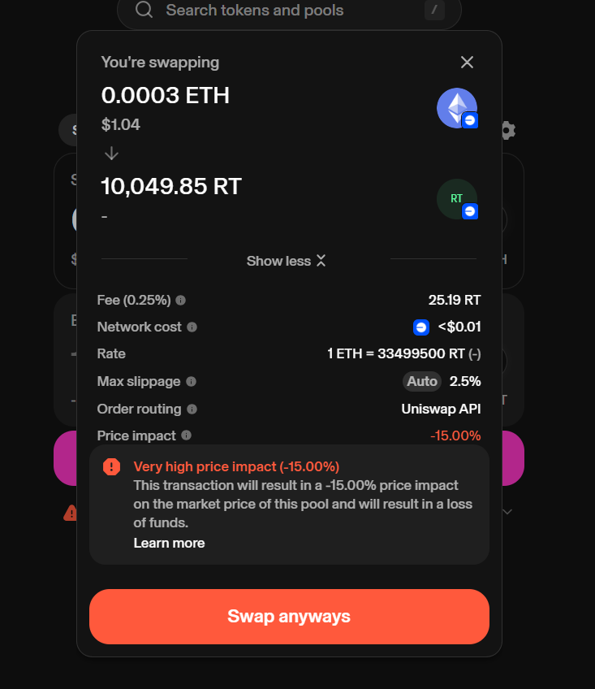
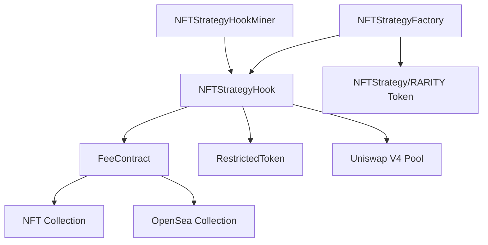

# 🚀 Rarity Town Protocol

## 📋 Overview

The **Rarity Town Protocol** is a decentralized protocol that creates ERC20 tokens (RARITY tokens) representing NFT collection strategies. Each RARITY token is paired with its underlying NFT collection and traded on Uniswap V4, with a sophisticated fee system that funds NFT vaults, enables buyback-and-burn mechanisms, and supports NFT trading through FeeContracts.

## 🌐 Latest Deployment - Base Mainnet

The protocol is currently deployed and verified on **Base Mainnet** with all contracts active and handling swaps with fees.

### Deployed Contracts

**Core Protocol Contracts (In Scope for Audit):**

| Contract | Address | BaseScan Link | Status | Audit Scope |
|----------|---------|---------------|---------|-------------|
| **NFTStrategyFactory** | `0x6E4Eef9b5ff69E7c22bB5EAD0a7dCc62ad567039` | [View on BaseScan](https://basescan.org/address/0x6E4Eef9b5ff69E7c22bB5EAD0a7dCc62ad567039#code) | ✅ Verified | ✅ In Scope |
| **NFTStrategyHook** | `0xFBa0486f0f12D77aA4D674BB64c4BB1C7f11A8C4` | [View on BaseScan](https://basescan.org/address/0xFBa0486f0f12D77aA4D674BB64c4BB1C7f11A8C4#code) | ✅ Verified | ✅ In Scope |
| **NFTStrategy (RARITY Token)** | `0xefd37af75982b8462c4589b9e820fca1bcaa8d86` | [View on BaseScan](https://basescan.org/token/0x9a6204114d072cdfcf5cebb6e4f93b0e72528ee3#code) | ✅ Verified | ✅ In Scope |
| **FeeContract** | `0x7f0025865005bc1593ac052e7d687c3ee4b72ad9` | [View on BaseScan](https://basescan.org/address/0x7b672e5e87da80656b43622ddc40c4b3dc6253ed#code) | ✅ Verified | ✅ In Scope |
| **NFTStrategyHookMiner** | `0xEA826b5B0e8872BA98c9e73A420Ae94d02037fe2` | [View on BaseScan](https://basescan.org/address/0xEA826b5B0e8872BA98c9e73A420Ae94d02037fe2#code) | ✅ Verified | ✅ In Scope |

**Supporting Contracts (Out of Scope for Audit):**

| Contract | Address | BaseScan Link | Status | Audit Scope |
|----------|---------|---------------|---------|-------------|
| **OpenSeaNFTBuyer** | `0x1df4E3643Dc9119Df655a0BfA9502AB9FaA6356c` | [View on BaseScan](https://basescan.org/address/0x1df4E3643Dc9119Df655a0BfA9502AB9FaA6356c#code) | ✅ Verified | ⚠️ Out of Scope (Library) |
| **RestrictedToken** | `0x11bd3952C622D69551DcE28b5b9769CA39c88dBc` | [View on BaseScan](https://basescan.org/address/0x11bd3952C622D69551DcE28b5b9769CA39c88dBc#code) | ✅ Verified | ⚠️ Out of Scope (Separate Deployment) |

### Network Information

- **Network**: Base Mainnet
- **Chain ID**: 8453
- **Status**: ✅ All contracts verified and operational
- **Fee System**: ✅ Active (15% flat fee on all swaps)
- **Swap Status**: ✅ Swaps working with fees collected
- **Last Migration**: ✅ Hook migrated with updated FeeContract (Nov 2025)
  - New Hook: `0xFBa0486f0f12D77aA4D674BB64c4BB1C7f11A8C4`
  - Previous Hook: `0xcd1d8048FC7bfec63118a5bF54D477dE3D3168C4` (kept for reference)
  - New Hook Miner: `0xEA826b5B0e8872BA98c9e73A420Ae94d02037fe2`
  - Previous Hook Miner: `0x58e925B1b1929565A878808010aea19097793111` (kept for reference)

### Uniswap V4 Integration on Base

The protocol is fully integrated with Uniswap V4 on Base Mainnet. Users can swap ETH for RARITY tokens directly through Uniswap's interface, with the hook automatically collecting and distributing fees.



*Example swap interface showing RARITY token (RT) trading on Uniswap V4 with fee collection (15% fee shown in the transaction details)*

### Quick Links

- **Factory Contract**: [View on BaseScan](https://basescan.org/address/0x6E4Eef9b5ff69E7c22bB5EAD0a7dCc62ad567039#code)
- **Hook Contract**: [View on BaseScan](https://basescan.org/address/0xFBa0486f0f12D77aA4D674BB64c4BB1C7f11A8C4#code)
- **RARITY Token**: [View on BaseScan](https://basescan.org/address/0xefd37af75982b8462c4589b9e820fca1bcaa8d86#code)
- **FeeContract**: [View on BaseScan](https://basescan.org/address/0x7f0025865005bc1593ac052e7d687c3ee4b72ad9#code)
- **RestrictedToken**: [View on BaseScan](https://basescan.org/address/0x11bd3952C622D69551DcE28b5b9769CA39c88dBc#code)

## 🏗️ Architecture Overview

### Protocol Components



### Contract Relationships

**Core Protocol Contracts (In Scope for Audit):**
1. **NFTStrategyFactory**: Main factory contract that deploys and manages RARITY tokens
2. **NFTStrategyHook**: Uniswap V4 hook that enforces fees, manages fee distribution, and acts as factory for FeeContract deployment
3. **NFTStrategy (RARITY Token)**: ERC20 token representing a collection strategy
4. **FeeContract**: Vault contract that holds NFTs, receives fees, and executes buyback/burn
5. **NFTStrategyHookMiner**: Utility for deterministic hook address mining via CREATE2

**Supporting Contracts (Not In Scope for Audit):**
- **RestrictedToken**: Base ERC20 with whitelist-based transfer restrictions (separate deployment)
- **OpenSeaNFTBuyer/OpenSeaPort**: Library contract for OpenSea Seaport integration
- **FakeNFTCollection**: Testing contract for protocol flow testing
- **SimpleSeller**: Testing contract for NFT purchase flow testing
- **Interfaces**: Interface definitions (IUniswapV4Router04, IAllowanceTransfer, IEIP712, ISignatureTransfer)

## 🔍 Audit Scope

### Contracts In Scope for Security Audit

The following contracts are the core protocol contracts and are **in scope for security audit**:

1. **NFTStrategyFactory** (`contracts/amock/NFTStrategyFactory.sol`)
   - Main factory contract
   - Handles token deployment and liquidity seeding
   - Manages protocol configuration

2. **NFTStrategyHook** (`contracts/amock/NFTStrategyHook.sol`)
   - Uniswap V4 hook implementation
   - Fee collection and distribution
   - FeeContract factory and management

3. **NFTStrategy** (`contracts/amock/NFTStrategy.sol`)
   - RARITY token implementation
   - Transfer restrictions and mid-swap protection

4. **FeeContract** (`contracts/amock/FeeContract.sol`)
   - NFT vault contract
   - Fee accumulation and NFT trading
   - TWAP buyback operations

5. **NFTStrategyHookMiner** (`contracts/NFTStrategyHookMiner.sol`)
   - Hook address mining utility
   - CREATE2 deployment helper

### Contracts Out of Scope

The following contracts are **not in scope for security audit** as they are testing utilities, library functions, or interface definitions:

**Testing Contracts:**
- `FakeNFTCollection.sol` - Test NFT collection for protocol testing
- `SimpleSeller.sol` - Test contract for NFT purchase flow testing

**Library/Helper Contracts:**
- `OpenSeaPort.sol` / `OpenSeaNFTBuyer` - OpenSea Seaport integration library
- These are external integrations and helper functions

**Interface Contracts:**
- `Interfaces.sol` - Interface definitions
- `IUniswapV4Router04.sol` - Uniswap V4 router interface
- `IAllowanceTransfer.sol` - Permit2 allowance transfer interface
- `IEIP712.sol` - EIP-712 interface
- `ISignatureTransfer.sol` - Permit2 signature transfer interface

**External Contracts:**
- `RestrictedToken.sol` - Deployed separately, not part of core protocol audit scope

## 📦 Core Contracts (In Scope for Audit)

### NFTStrategyFactory

**Status**: ✅ **In Scope for Audit**

**Role**: Deploys RARITY tokens, manages protocol configuration, seeds liquidity, and handles TWAP operations.

**Key Features**:
- Deploys new `NFTStrategy` (RARITY) tokens for NFT collections
- Seeds initial liquidity into Uniswap V4 pools
- Manages launch permissions (public launches, collection owner launches)
- Enforces router restrictions and transfer validation
- Handles TWAP (Time-Weighted Average Price) buyback operations for RestrictedToken
- Gates liquidity loading to prevent unauthorized pool initialization

**Key Functions**:
- `launchNFTStrategy(collection, tokenName, tokenSymbol)`: Deploys a new RARITY token, creates Uniswap V4 pool, seeds liquidity, and performs initial purchase
- `ownerLaunchNFTStrategy(...)`: Owner-only launch function
- `processTokenTwap()`: Executes buyback-and-burn of RestrictedToken with caller reward
- `validTransfer(from, to, tokenAddress)`: Validates transfers for RARITY tokens

**State Variables**:
- `loadingLiquidity`: Flag that gates pool initialization and liquidity additions
- `deployerBuying`: Flag indicating factory-initiated token purchases
- `routerRestrict`: Controls transfer restrictions
- `listOfRouters`: Whitelist of authorized router addresses
- `feeToLaunch`: Launch fee required to create new strategies
- `publicLaunches`: Whether public users can launch strategies
- `collectionOwnerLaunches`: Whether collection owners can launch strategies
- `twapIncrement`: Amount of ETH to use per TWAP operation (default: 1 ETH)
- `twapDelayInBlocks`: Minimum blocks between TWAP operations (default: 1)

**Launch Flow**:
1. User calls `launchNFTStrategy()` with collection address, token name, and symbol
2. Factory validates collection is ERC721 and checks launch permissions
3. Factory deploys new `NFTStrategy` contract (mints MAX_SUPPLY to factory)
4. Factory sets `loadingLiquidity = true` and initializes Uniswap V4 pool
5. Factory adds initial liquidity (1 wei ETH : MAX_SUPPLY tokens)
6. Factory calls hook to set fee address for the new RARITY token
7. Factory performs initial purchase (0.01 ETH) to make token appear on Uniswap UI
8. Factory sets `loadingLiquidity = false`
9. Excess ETH (after launch fee) is sent to fee address

### NFTStrategy (RARITY Token)

**Status**: ✅ **In Scope for Audit**

**Role**: ERC20 token representing an NFT collection strategy. Non-transferable between EOAs, but tradeable via Uniswap V4 DEX.

**Key Features**:
- Maximum supply: 1,000,000,000 tokens (1 billion)
- All tokens minted to factory at deployment
- Transfer restrictions enforced via Factory's `validTransfer()` logic
- Mid-swap flag prevents unauthorized transfers during swaps
- Legacy NFT trading functions disabled (moved to FeeContract)
- Legacy fee collection disabled (moved to FeeContract)

**Transfer Restrictions**:
- Transfers allowed only through whitelisted routers (Uniswap V4 flow)
- Direct EOA-to-EOA transfers are blocked
- During swaps, `midSwap` flag is set to prevent sandwich attacks
- Factory's `validTransfer()` enforces routing through authorized contracts

**State Variables**:
- `priceMultiplier`: Multiplier for NFT sale prices (default: 1200 = 20% markup)
- `midSwap`: Flag set by hook during swap operations
- `MAX_SUPPLY`: Maximum token supply (1 billion)
- `DEADADDRESS`: Address for token burns (0x...dEaD)

**Key Functions**:
- `setMidSwap(bool value)`: Called by hook to set mid-swap flag
- `updateName(string)`: Factory can update token name
- `updateSymbol(string)`: Factory can update token symbol
- `setPriceMultiplier(uint256)`: Factory can update price multiplier

### NFTStrategyHook

**Status**: ✅ **In Scope for Audit**

**Role**: Uniswap V4 hook that enforces 15% flat fee on all swaps, converts fees to ETH, and distributes to FeeContract and founder wallets. Also acts as factory for FeeContract deployment, deploying them mapped to Token Strategy Contracts.

**Key Features**:
- **Flat Fee**: 15% on all swaps (buy and sell)
- **Fee Distribution**: 14% to active FeeContract, 0.25% to founder wallet 1, 0.75% to founder wallet 2
- **Fee Conversion**: Automatically swaps non-ETH fees to ETH
- **Mid-Swap Protection**: Sets `midSwap` flag on RARITY tokens during swaps
- **Liquidity Gating**: Only allows liquidity operations during `loadingLiquidity`
- **Manual FeeContract Management**: Admin deploys and rotates FeeContracts manually

**Hook Permissions**:
- ✅ `beforeInitialize`: Validates pool initialization (only during liquidity loading)
- ✅ `beforeAddLiquidity`: Gates liquidity additions (only during liquidity loading)
- ✅ `beforeSwap`: Sets mid-swap flags on RARITY tokens
- ✅ `afterSwap`: Collects fees, converts to ETH, and distributes
- ✅ `afterSwapReturnDelta`: Returns fee amounts to pool manager
- ❌ All donate and remove-liquidity hooks disabled

**Fee Processing Flow**:
1. Hook calculates 15% fee from swap amount
2. Hook takes fee from pool manager
3. If fee is not in ETH, hook swaps fee token to ETH
4. Hook splits fee: 14% to active FeeContract, 0.25% to founder wallet 1, 0.75% to founder wallet 2
5. If no FeeContract exists, vault portion (14%) is split proportionally: 3.5% to wallet 1, 10.5% to wallet 2 (total 15%: 3.75% + 11.25%)
6. Hook emits `HookFee` event with fee details

**State Variables**:
- `FLAT_FEE`: 1500 (15% in basis points)
- `VAULT_FEE_PORTION`: 1400 (14% to vault)
- `FOUNDER_FEE_PORTION_1`: 25 (0.25% to founder wallet 1)
- `FOUNDER_FEE_PORTION_2`: 75 (0.75% to founder wallet 2)
- `FOUNDER_FEE_PORTION`: 100 (1% total, kept for compatibility)
- `activeFeeContract`: Mapping from RARITY token to active FeeContract
- `feeContractToRarityToken`: Reverse mapping from FeeContract to RARITY token
- `founderWallet1`: Address receiving 0.25% founder fees
- `founderWallet2`: Address receiving 0.75% founder fees
- `founderWallet`: Legacy address (kept for compatibility)
- `hotWallet`: Authorized address for getter functions
- `authorizedCallers`: Mapping of authorized addresses for getter access
- `routerAddress`: Address of Uniswap V4 router
- `openSeaBuyer`: Address of OpenSeaNFTBuyer contract

**Key Functions**:
- `calculateFee(collection, isBuying)`: Returns 15% flat fee (0% if deployer buying)
- `_processFees(rarityToken, feeAmount)`: Distributes fees to vault (14%) and founder wallets (0.25% to wallet 1, 0.75% to wallet 2)
- `_swapToEth(key, amount)`: Converts non-ETH fees to ETH
- `deployNewFeeContract(rarityToken)`: Manually deploy new FeeContract
- `forceRotateFeeContract(rarityToken)`: Force create new FeeContract (replaces current)
- `setHotWallet(address)`: Set authorized hot wallet for getter functions
- `fundHotWallet(uint256)`: Fund hot wallet with ETH from hook

**Hot Wallet System**:
- Hot wallet can call authorized getter functions without being admin
- Getter functions include:
  - `isFeeContractFull(feeContractAddress)`: Check if vault is full
  - `getFeeContractHoldings(feeContractAddress)`: Get NFT count
  - `getFeeContractFees(feeContractAddress)`: Get ETH balance
  - `getFeeContractInfo(feeContractAddress)`: Get comprehensive vault info
  - `getRarityTokenFromFeeContract(feeContractAddress)`: Get associated RARITY token
  - `getCollectionFromFeeContract(feeContractAddress)`: Get associated collection

### FeeContract (Vault)

**Status**: ✅ **In Scope for Audit**

**Role**: Vault that holds NFTs (max 5), receives ETH fees, purchases NFTs from multiple sources, lists NFTs with markup, and executes TWAP buyback-and-burn.

**Key Features**:
- **Capacity**: Maximum 5 NFTs per vault
- **Fee Collection**: Receives 14% of swap fees via `addFees()`
- **Smart Buying**: Chooses cheapest NFT source (OpenSea, collection marketplace, previous FeeContract)
- **Price Markup**: Lists NFTs with 20% markup (1.2x multiplier)
- **TWAP Buyback**: Executes buyback-and-burn of RARITY tokens
- **Ownership Verification**: Verifies previous FeeContract actually owns NFT before purchasing

**NFT Trading Flow**:
1. **Fee Accumulation**: Hook sends 14% of swap fees to FeeContract via `addFees()`
2. **Smart Purchase**: Off-chain service calls `smartBuyNFT()` with:
   - Token ID to purchase
   - Previous FeeContract address (optional)
   - OpenSea order (optional)
3. **Price Comparison**: Contract compares prices from:
   - Collection marketplace (`listings(tokenId)`)
   - Previous FeeContract (`nftForSale(tokenId)`)
   - OpenSea order (from order parameters)
4. **Purchase Execution**: Contract buys from cheapest valid source
5. **Listing**: Contract lists NFT with 20% markup (priceMultiplier = 1200)
6. **User Purchase**: Users call `sellTargetNFT(tokenId)` with exact price
7. **TWAP Accumulation**: Sale proceeds accumulate in `ethToTwap` for buyback

**Smart Buy Logic**:
- Checks collection marketplace first (via `ICollectionWithListings.listings()`)
- Checks previous FeeContract if provided (verifies ownership)
- Checks OpenSea order if provided (validates order parameters)
- Selects cheapest available option
- Verifies NFT ownership after purchase
- Updates `currentHoldings` and `currentFees`

**TWAP Buyback System**:
- **Increment**: 1 ETH per operation (configurable)
- **Delay**: 1 block minimum between operations
- **Reward**: 0.5% to caller (5 basis points)
- **Burn Target**: Dead address (0x...dEaD)
- **Execution**: Swaps ETH for RARITY tokens via Uniswap V4 and sends to dead address

**State Variables**:
- `MAX_NFTS`: Maximum NFTs per vault (5)
- `currentHoldings`: Number of NFTs currently held
- `currentFees`: ETH balance available for purchases
- `priceMultiplier`: Markup multiplier (default: 1200 = 20%)
- `nftForSale`: Mapping from tokenId to sale price
- `heldTokenIds`: Array tracking all tokenIds held by this contract (for enumeration and floor price calculation)
- `ethToTwap`: Accumulated ETH for buyback operations
- `lastTwapBlock`: Last block TWAP was executed
- `TWAP_INCREMENT`: Amount of ETH per TWAP operation (1 ETH)
- `TWAP_DELAY_BLOCKS`: Minimum blocks between TWAP operations (1)

**Key Functions**:
- `addFees()`: Receive ETH fees from hook (hook-only)
- `smartBuyNFT(previousFeeContract, openSeaOrder)`: Purchase NFT from cheapest source (OpenSea or previous FeeContract)
  - `tokenId` is extracted from `openSeaOrder.offerIdentifier`
  - Compares floor price from previous FeeContract (enumerates all held NFTs) vs OpenSea price
- `buyTargetNFT(value, data, expectedId, target)`: Generic NFT purchase function
- `sellTargetNFT(tokenId)`: Sell NFT to user (payable, exact price required)
  - Removes `tokenId` from `heldTokenIds` array upon sale
- `getHeldTokenIds()`: Returns array of all tokenIds currently held by this contract
- `processTokenTwap()`: Execute TWAP buyback-and-burn with caller reward
- `buybackAndBurn(amountIn)`: Direct buyback function (no delay/reward)
- `setPriceMultiplier(uint256)`: Factory can update markup (1100-10000 range)
- `emergencyWithdraw()`: Factory owner can withdraw ETH (emergency only)

### NFTStrategyHookMiner

**Status**: ✅ **In Scope for Audit**

**Role**: Utility contract for deterministic hook address mining using CREATE2 and salt computation.

**Key Features**:
- **Salt Mining**: Pre-computes salt to achieve desired hook address
- **CREATE2 Deployment**: Deploys hook with deterministic address
- **Permission Configuration**: Mines addresses with required hook permissions
- **Address Verification**: Verifies deployed address matches predicted address

**Key Functions**:
- `simulateSalt(...)`: Pre-computes salt for desired hook address
- `storeSalt(hook, salt)`: Stores mined salt on-chain
- `deployHook(...)`: Deploys hook via CREATE2 with stored salt
- `getMinedData()`: Returns stored hook address and salt
- `getHookPermissions()`: Returns required permissions structure

## 📚 Supporting Contracts (Out of Scope for Audit)

The following contracts are used by the protocol but are **not in scope for security audit**:

### RestrictedToken

**Status**: ⚠️ **Out of Scope** (Deployed separately)

**Role**: Base ERC20 token with whitelist-based transfer restrictions compatible with Uniswap V4 routing architecture.

**Note**: This contract is deployed separately and used for TWAP buyback operations. It is not part of the core protocol audit scope.

**Key Features**:
- **Whitelist System**: Transfers allowed if either sender or receiver is whitelisted
- **Router Compatibility**: Supports Uniswap V4 flow (User → Router → PoolManager → User)
- **Mid-Swap Protection**: Prevents unauthorized transfers during swaps
- **Trading Control**: Can enable/disable trading, toggle restrictions

### OpenSeaNFTBuyer / OpenSeaPort

**Status**: ⚠️ **Out of Scope** (Library/Helper Contract)

**Role**: Helper contract for purchasing NFTs from OpenSea marketplace via Seaport protocol.

**Note**: This is a library/helper contract for OpenSea Seaport integration. It is used by FeeContract for smart buying but is not part of the core protocol audit scope.

**Key Features**:
- **Seaport Integration**: Interacts with Seaport 1.6 on Base network
- **Order Fulfillment**: Fulfills OpenSea orders with ETH payment
- **Multiple Order Types**: Supports full orders, advanced orders, and basic orders

## 🔄 System Workflow

### 1. Launch Flow

1. **User Request**: User calls `NFTStrategyFactory.launchNFTStrategy(collection, name, symbol)` with launch fee
2. **Validation**: Factory validates:
   - Collection is ERC721 (`supportsInterface(0x80ac58cd)`)
   - Collection not already launched
   - Launch permissions (public or collection owner)
   - Exact launch fee paid
3. **Token Deployment**: Factory deploys new `NFTStrategy` contract:
   - Mints MAX_SUPPLY (1 billion) to factory
   - Sets collection, hook, router addresses
   - Sets token name and symbol
4. **Pool Initialization**: Factory sets `loadingLiquidity = true` and:
   - Initializes Uniswap V4 pool with starting price
   - Adds initial liquidity (1 wei ETH : MAX_SUPPLY tokens)
   - Hook validates initialization via `beforeInitialize`
5. **Fee Configuration**: Factory calls hook to set fee address for new RARITY token
6. **Initial Purchase**: Factory performs initial purchase (0.01 ETH) to make token appear on Uniswap UI
7. **Completion**: Factory sets `loadingLiquidity = false`, sends excess ETH to fee address, emits `NFTStrategyLaunched` event

### 2. Swap Flow

1. **User Initiates**: User calls Uniswap V4 router to swap ETH for RARITY tokens (or vice versa)
2. **Before Swap**: Hook's `beforeSwap` is called:
   - Sets `midSwap = true` on RARITY token (if router restrictions enabled)
   - Prevents unauthorized transfers during swap
3. **Swap Execution**: Uniswap V4 PoolManager executes swap
4. **After Swap**: Hook's `afterSwap` is called:
   - Calculates 15% fee from swap amount
   - Takes fee from pool manager
   - If fee is not ETH, swaps fee token to ETH
   - Splits fee: 14% to active FeeContract, 0.25% to founder wallet 1, 0.75% to founder wallet 2
   - If no FeeContract exists, vault portion (14%) is split proportionally to founder wallets
   - Sets `midSwap = false` on RARITY token
   - Emits `HookFee` and `Trade` events

### 3. Fee Processing Flow

1. **Fee Collection**: Hook receives 15% fee from swap
2. **Fee Conversion**: If fee is not ETH, hook swaps to ETH via internal swap
3. **Fee Distribution**:
   - 14% sent to active FeeContract via `addFees()` (if exists)
   - 0.25% sent to founder wallet 1 (or fee address if claimed by owner)
   - 0.75% sent to founder wallet 2
   - If no FeeContract exists, vault portion (14%) is split proportionally: 3.5% to wallet 1, 10.5% to wallet 2
   - Total distribution when no FeeContract: 3.75% to wallet 1, 11.25% to wallet 2
4. **Vault Accumulation**: FeeContract accumulates ETH in `currentFees`

> **Note**: For detailed information on FeeContract fee collection, deployment, and rotation, see [Section 4: FeeContract Deployment and Management Flow](#4-feecontract-deployment-and-management-flow).

### 4. FeeContract Deployment and Management Flow

#### 4.1 Initial FeeContract Deployment

1. **Admin Decision**: Factory owner decides to deploy FeeContract for a RARITY token
2. **Deployment Call**: Admin calls `NFTStrategyHook.deployNewFeeContract(rarityToken)`:
   - Hook validates caller is factory owner
   - Hook retrieves collection address from factory mapping
   - Hook validates collection exists and is not zero address
   - Hook deploys new `FeeContract` contract with:
     - Factory address
     - Hook address
     - Uniswap V4 Router address
     - Collection address
     - RARITY token address
     - OpenSea buyer address
3. **Registration**: Hook registers new FeeContract:
   - Sets `activeFeeContract[rarityToken] = newFeeContract`
   - Sets `feeContractToRarityToken[newFeeContract] = rarityToken`
   - Creates bidirectional mapping for lookup
4. **Fee Routing**: After deployment, all future fees (14% of swap fees) are routed to this FeeContract

#### 4.2 Fee Collection Flow

1. **Swap Occurs**: User swaps ETH for RARITY tokens (or vice versa) on Uniswap V4
2. **Fee Calculation**: Hook calculates 15% fee from swap amount
3. **Fee Distribution**: Hook's `_processFees()` function:
   - Calculates 14% vault portion, 0.25% founder portion 1, and 0.75% founder portion 2
   - Checks if active FeeContract exists for RARITY token
   - If FeeContract exists:
     - Calls `activeFeeContract.addFees{value: vaultAmount}()`
     - FeeContract receives ETH and increments `currentFees`
     - 0.25% sent to founder wallet 1 (or fee address if claimed by owner)
     - 0.75% sent to founder wallet 2
     - Emits `FeesAdded` event
   - If no FeeContract exists:
     - Vault portion (14%) is split proportionally: 25% to wallet 1 (3.5%), 75% to wallet 2 (10.5%)
     - Total distribution: 3.75% to wallet 1 (0.25% + 3.5%), 11.25% to wallet 2 (0.75% + 10.5%)
4. **Fee Accumulation**: FeeContract accumulates ETH in `currentFees` state variable
5. **Usage**: Accumulated fees can be used for:
   - NFT purchases via `smartBuyNFT()` or `buyTargetNFT()`
   - TWAP buyback operations
   - Emergency withdrawal (factory owner only)

#### 4.3 FeeContract Rotation Flow

1. **Monitoring**: Admin or off-chain service monitors FeeContract:
   - Checks `currentHoldings` (should be < 5)
   - Monitors `isFull()` status
   - Tracks capacity via `getFeeContractHoldings()` (hot wallet authorized)
2. **Rotation Decision**: Admin decides to rotate FeeContract:
   - Option A: Deploy new FeeContract (current continues operating)
   - Option B: Force rotate (replaces current FeeContract)
3. **New Deployment**: Admin calls `deployNewFeeContract(rarityToken)`:
   - New FeeContract deployed with same parameters
   - New FeeContract set as active for RARITY token
   - Previous FeeContract remains accessible but inactive
   - Previous FeeContract can still sell NFTs to users
4. **Force Rotation**: Admin calls `forceRotateFeeContract(rarityToken)`:
   - Deploys new FeeContract (even if current is not full)
   - Replaces current active FeeContract immediately
   - All future fees go to new FeeContract
   - Previous FeeContract can still sell its NFTs
5. **Previous FeeContract**: Previous FeeContract:
   - Can still receive direct purchases via `sellTargetNFT()`
   - Can be used as source for smart buys in new FeeContract
   - Retains its NFTs and ETH balance
   - Can execute TWAP on accumulated `ethToTwap`

### 5. NFT Trading Flow - Smart Buying System

#### 5.1 Smart Buy Function - Price Comparison and Purchase

The FeeContract implements a sophisticated smart buying system that compares prices across multiple sources and purchases from the cheapest available option.

1. **Price Discovery**: Off-chain service or admin calls `FeeContract.smartBuyNFT(previousFeeContract, openSeaOrder)`:
   - **Note**: The `tokenId` is extracted from `openSeaOrder.offerIdentifier` (not provided separately)
   - **Previous FeeContract Check**:
     - If `previousFeeContract` is provided (≠ address(0)):
       - Calls `IFeeContract(previousFeeContract).getHeldTokenIds()` to get all NFTs held by previous vault
       - Enumerates through all held NFTs (up to MAX_NFTS = 5) to find the floor price
       - For each held NFT, calls `IFeeContract(previousFeeContract).nftForSale(tokenId)` to get sale price
       - Selects the cheapest NFT available from previous FeeContract
       - Sets `feeContractPrice` and `availableOnFeeContract = true`
       - Sets `feeContractTokenId` to the tokenId of the cheapest NFT
   - **OpenSea Check**:
     - If `openSeaOrder` is provided:
       - Extracts `tokenId` from `openSeaOrder.offerIdentifier`
       - Validates order parameters (NFT token, tokenId match collection)
       - Calculates total price from `considerationAmount` + sum of `additionalRecipients` amounts
       - Sets `openSeaPrice` and `availableOnOpenSea = true`

2. **Price Comparison Algorithm**:
   - Initializes `purchasePrice = type(uint256).max`
   - Compares all available sources:
     - If previous FeeContract available and `feeContractPrice < purchasePrice`:
       - Sets `purchasePrice = feeContractPrice`, `buyFrom = 1`, `purchaseTokenId = feeContractTokenId`
     - If OpenSea available and `openSeaPrice < purchasePrice`:
       - Sets `purchasePrice = openSeaPrice`, `buyFrom = 2`, `purchaseTokenId = openSeaOrder.offerIdentifier`
   - Selects cheapest valid option
   - **Note**: Collection marketplace check has been removed - only OpenSea and previous FeeContract are compared

3. **Validation**:
   - Checks `currentHoldings < MAX_NFTS` (5 NFTs max)
   - Validates NFT not already owned by current FeeContract
   - Validates `purchasePrice <= currentFees` (sufficient ETH balance)
   - Reverts if no valid source found

4. **Purchase Execution**:
   - **From Previous FeeContract** (`buyFrom = 1`):
     - Calls `previousFeeContract.sellTargetNFT{value: purchasePrice}(purchaseTokenId)`
     - Purchases from previous vault at floor price (cheapest NFT from all held NFTs)
   - **From OpenSea** (`buyFrom = 2`):
     - Calls `openSeaBuyer.buyNFTBasic(openSeaOrder)` with `purchasePrice` ETH
     - Fulfills Seaport BasicOrder via OpenSea buyer contract
     - Uses `BasicOrderParameters` struct with `tokenId` in `offerIdentifier`

5. **Purchase Verification**:
   - Verifies NFT balance increased by 1
   - Verifies FeeContract owns the NFT (`collection.ownerOf(tokenId) == address(this)`)
   - Calculates actual cost (`ethBalanceBefore - ethBalanceAfter`)
   - Reverts if verification fails

6. **State Updates**:
   - Deducts actual cost from `currentFees`
   - Increments `currentHoldings`
   - Adds `purchaseTokenId` to `heldTokenIds` array (for tracking all NFTs held)
   - Calculates sale price with markup: `salePrice = actualCost * priceMultiplier / 1000`
   - Sets `nftForSale[purchaseTokenId] = salePrice`
   - Emits `NFTBoughtByProtocol(purchaseTokenId, purchasePrice, salePrice)` event

#### 5.2 Simple Buy Function - Direct Purchase

For direct purchases from arbitrary sources (not covered by smart buy):

1. **Call**: Admin or authorized caller calls `FeeContract.buyTargetNFT(value, data, expectedId, target)`:
   - Provides ETH value, calldata, expected tokenId, and target address
2. **Validation**:
   - Checks `currentHoldings < MAX_NFTS`
   - Validates NFT not already owned
   - Validates `value <= currentFees`
3. **Purchase Execution**:
   - Makes external call to target with ETH value and calldata
   - Verifies NFT received (balance check)
   - Verifies ownership of expected tokenId
4. **State Updates**:
   - Deducts cost from `currentFees`
   - Increments `currentHoldings`
   - Lists NFT with markup
   - Emits purchase event

#### 5.3 Simple Sell Function - Direct Sale

1. **User Purchase**: User calls `FeeContract.sellTargetNFT(tokenId)` with exact ETH amount:
   - User must send exact `salePrice` (from `nftForSale[tokenId]`)
2. **Validation**:
   - Validates `salePrice > 0` (NFT is for sale)
   - Validates `msg.value == salePrice` (exact price paid)
   - Validates FeeContract owns the NFT
3. **Sale Execution**:
   - Transfers NFT from FeeContract to user via `collection.transferFrom()`
   - Deletes `nftForSale[tokenId]` mapping
   - Accumulates ETH in `ethToTwap` for buyback operations
   - **Note**: `currentHoldings` is NOT decremented (NFT was bought to be held)
4. **Completion**:
   - Emits `NFTSoldByProtocol(tokenId, salePrice, buyer)` event
   - ETH accumulates for TWAP buyback

#### 5.4 Price Markup System

- **Default Markup**: 20% (priceMultiplier = 1200)
- **Calculation**: `salePrice = purchasePrice * 1200 / 1000`
- **Configurable**: Factory owner can update `priceMultiplier` (1100-10000 range)
- **Purpose**: Ensures FeeContract profits from NFT trades, funding TWAP buyback

### 6. TWAP Buyback Flow

1. **Accumulation**: ETH accumulates in `FeeContract.ethToTwap` from NFT sales
2. **Trigger**: Anyone calls `FeeContract.processTokenTwap()` after delay period
3. **Validation**: Contract checks:
   - `ethToTwap > 0`
   - `block.number >= lastTwapBlock + TWAP_DELAY_BLOCKS` (1 block minimum)
4. **Execution**: Contract:
   - Calculates burn amount (min of `ethToTwap` and `TWAP_INCREMENT` = 1 ETH)
   - Calculates caller reward (0.5% of burn amount = 5 basis points)
   - Deducts reward from burn amount
   - Swaps ETH for RARITY tokens via Uniswap V4:
     - Creates PoolKey with ETH and RARITY token
     - Calls router `swapExactTokensForTokens()` with burn amount
     - Sends RARITY tokens to dead address (0x...dEaD) for burn
   - Sends reward to caller
   - Updates `lastTwapBlock = block.number`
   - Updates `ethToTwap -= (burnAmount + reward)`
5. **Event**: Contract emits `BuybackAndBurn(ethAmount, rarityBurned)` event
6. **Direct Buyback**: Alternative function `buybackAndBurn(amountIn)`:
   - Allows direct buyback from `currentFees` (no delay, no reward)
   - Useful for immediate buyback without waiting for delay

## ⚙️ Protocol Configuration

### Fee Structure

- **Flat Fee**: 15% on all swaps (buy and sell)
- **Vault Fee**: 14% to active FeeContract
- **Founder Fee 1**: 0.25% to founder wallet 1
- **Founder Fee 2**: 0.75% to founder wallet 2
- **Total Founder Fee**: 1% (split between two wallets)
- **Fallback Distribution** (when no FeeContract): 3.75% to wallet 1, 11.25% to wallet 2 (vault portion split proportionally)
- **TWAP Reward**: 0.5% to TWAP caller
- **Price Markup**: 20% (1.2x multiplier) for NFT resale

### Capacity Limits

- **Max NFTs per Vault**: 5 NFTs
- **TWAP Increment**: 1 ETH per operation
- **TWAP Delay**: 1 block minimum between operations

### Launch Configuration

- **Launch Fee**: Configurable (typically 0.01 ETH)
- **Public Launches**: Can be enabled/disabled
- **Collection Owner Launches**: Can be enabled/disabled
- **Initial Purchase**: 0.01 ETH (to make token appear on Uniswap UI)

### Transfer Restrictions

- **Router Restrictions**: Enabled by default
- **Mid-Swap Protection**: Enabled during swaps
- **Whitelist System**: Core protocol addresses whitelisted
- **Emergency Toggle**: Restrictions can be disabled by owner

## 🔒 Security Features

### Transfer Restrictions

- **Router-Only Trading**: RARITY tokens can only be traded via whitelisted routers
- **Mid-Swap Protection**: Prevents sandwich attacks during swaps
- **Whitelist Validation**: Factory validates all transfers via `validTransfer()`
- **Emergency Override**: Owner can disable restrictions if needed

### Liquidity Protection

- **Loading Gating**: Only factory can add liquidity during `loadingLiquidity`
- **Initialization Validation**: Hook validates pool initialization
- **Unauthorized Prevention**: Prevents unauthorized pool creation

### Fee Security

- **Hook-Only Fees**: FeeContract only accepts fees from hook
- **Ownership Verification**: Verifies NFT ownership before purchasing from previous vault
- **Reentrancy Protection**: All state-changing functions use `nonReentrant` modifier

### Access Control

- **Owner-Only Functions**: Critical functions restricted to factory owner
- **Hook-Only Functions**: Fee functions restricted to hook
- **Hot Wallet System**: Authorized getter access without admin privileges

## 📊 Events and Observability

### NFTStrategyFactory Events

- `NFTStrategyLaunched(collection, nftStrategy, tokenName, tokenSymbol)`: Emitted when new strategy is launched

### NFTStrategyHook Events

- `HookFee(id, sender, feeAmount0, feeAmount1)`: Emitted when fee is collected
- `Trade(nftStrategy, sqrtPriceX96, ethAmount, tokenAmount)`: Emitted on each swap

### FeeContract Events

- `FeesAdded(amount, from)`: Emitted when fees are received
- `NFTBoughtByProtocol(tokenId, purchasePrice, listPrice)`: Emitted when NFT is purchased
- `NFTSoldByProtocol(tokenId, price, buyer)`: Emitted when NFT is sold
- `BuybackAndBurn(ethAmount, rarityBurned)`: Emitted on TWAP execution

## 🧪 Testing Contracts (Out of Scope for Audit)

The following contracts are **testing utilities** used for protocol flow testing and are **not in scope for security audit**:

### FakeNFTCollection

**Status**: ⚠️ **Out of Scope** (Testing Contract)

**Role**: Test ERC721 collection with built-in marketplace functionality.

**Note**: This is a testing contract used for protocol flow testing. It simulates an NFT collection with marketplace functionality for testing purposes.

**Features**:
- **Pre-minting**: 10 NFTs pre-minted to deployer
- **Max Supply**: 1,000 NFTs
- **Marketplace**: Built-in listing/buying functionality
- **Escrow System**: NFTs held in contract during listing

**Key Functions**:
- `mint(address to)`: Mint new NFT
- `list(uint256 tokenId, uint256 price)`: List NFT for sale
- `buy(uint256 tokenId)`: Buy listed NFT
- `cancel(uint256 tokenId)`: Cancel listing

### SimpleSeller

**Status**: ⚠️ **Out of Scope** (Testing Contract)

**Role**: Minimal seller contract for testing NFT purchases.

**Note**: This is a testing contract used for NFT purchase flow testing. It is not part of the core protocol audit scope.

**Features**:
- **Fixed Price**: Pre-configured price for specific token
- **Strategy Integration**: Designed to work with `buyTargetNFT()`
- **Automatic Transfer**: Transfers NFT on receiving ETH

## 🧭 Usage Guide

### Launching a Strategy

```solidity
// Connect to factory contract
const factory = await ethers.getContractAt("NFTStrategyFactory", factoryAddress);

// Launch new NFTStrategy
const tx = await factory.launchNFTStrategy(
  collectionAddress,
  "Token Name",
  "SYMBOL",
  { value: ethers.parseEther("0.01") } // Launch fee
);

const receipt = await tx.wait();
// Extract RARITY token address from events
```

### Setting Up Hot Wallet

```solidity
// Generate hot wallet
const hotWallet = ethers.Wallet.createRandom();

// Set hot wallet in hook (admin only)
const hook = await ethers.getContractAt("NFTStrategyHook", hookAddress);
await hook.setHotWallet(hotWallet.address);

// Fund hot wallet
await hook.fundHotWallet(ethers.parseEther("0.1"));

// Hot wallet can now call getter functions
const isFull = await hook.connect(hotWallet).isFeeContractFull(feeContractAddress);
```

### Deploying FeeContract

```solidity
// Deploy new FeeContract (admin only)
const hook = await ethers.getContractAt("NFTStrategyHook", hookAddress);
const newFeeContract = await hook.deployNewFeeContract(rarityTokenAddress);

// Or force rotate existing FeeContract
const rotatedFeeContract = await hook.forceRotateFeeContract(rarityTokenAddress);
```

### Performing Smart NFT Buy

```solidity
// Prepare OpenSea order (if available)
const openSeaOrder = {
  parameters: { /* order parameters */ },
  signature: "0x..."
};

// Call smart buy
const feeContract = await ethers.getContractAt("FeeContract", feeContractAddress);
await feeContract.smartBuyNFT(
  tokenId,
  previousFeeContractAddress, // optional
  openSeaOrder // optional
);
```

### Triggering TWAP

```solidity
// Call TWAP function (anyone can call after delay)
const feeContract = await ethers.getContractAt("FeeContract", feeContractAddress);
await feeContract.processTokenTwap();

// Caller receives 0.5% reward
// RARITY tokens are burned to dead address
```

## 🔧 Configuration

### Factory Configuration

- `updateHookAddress(hookAddress)`: Set hook address
- `setRestrictedTokenHookAddress(hookAddress)`: Set restricted token hook address
- `updateFeeToLaunch(amount)`: Set launch fee
- `setPublicLaunches(bool)`: Enable/disable public launches
- `setCollectionOwnerLaunches(bool)`: Enable/disable collection owner launches
- `setRouter(address, bool)`: Add/remove router from whitelist
- `setRouterRestrict(bool)`: Enable/disable router restrictions

### Hook Configuration

- `setRouterAddress(routerAddress)`: Set Uniswap V4 router address
- `setOpenSeaBuyer(openSeaBuyerAddress)`: Set OpenSea buyer contract
- `setFounderWallet1(founderWallet1)`: Set founder wallet 1 address (0.25% recipient)
- `setFounderWallet2(founderWallet2)`: Set founder wallet 2 address (0.75% recipient)
- `getFounderWallet1()`: Get founder wallet 1 address
- `getFounderWallet2()`: Get founder wallet 2 address
- `setFounderWallet(founderWallet)`: Set legacy founder wallet address (kept for compatibility)
- `setHotWallet(hotWallet)`: Set hot wallet address
- `setAuthorizedCaller(caller, authorized)`: Add/remove authorized callers
- `deployNewFeeContract(rarityToken)`: Deploy new FeeContract
- `forceRotateFeeContract(rarityToken)`: Force rotate FeeContract

### RestrictedToken Configuration

- `setPoolManager(poolManager)`: Set PoolManager address
- `setHook(hookAddress)`: Set authorized hook address
- `setSwapRouter(routerAddress)`: Set swap router address
- `setWhitelist(address, bool)`: Add/remove addresses from whitelist
- `setTradingEnabled(bool)`: Enable/disable trading
- `setRestrictionActive(bool)`: Toggle restriction system

### FeeContract Configuration

- `setPriceMultiplier(multiplier)`: Update price markup (1100-10000 range)
- `emergencyWithdraw()`: Emergency withdrawal (factory owner only)

## 📑 Technical Specifications

### Solidity Configuration

- **Version**: 0.8.20 - 0.8.26
- **Optimizer**: Enabled (200 runs)
- **Via IR**: Enabled
- **EVM Version**: Cancun
- **Features**: Transient storage (tload/tstore), ReentrancyGuard

### Uniswap V4 Integration

- **Pool Manager**: Uniswap V4 PoolManager contract
- **Position Manager**: Uniswap V4 PositionManager contract
- **Universal Router**: Uniswap Universal Router contract
- **Permit2**: Permit2 contract for token approvals
- **Router**: Uniswap V4 Router contract

### Hook Permissions

- ✅ `beforeInitialize`: Validate NFTStrategy launches
- ✅ `beforeAddLiquidity`: Restrict liquidity operations
- ✅ `beforeSwap`: Set mid-swap flags
- ✅ `afterSwap`: Collect fees and process
- ✅ `afterSwapReturnDelta`: Return fee amounts
- ❌ All donate hooks disabled
- ❌ All remove-liquidity hooks disabled

## 🔍 Key Design Decisions

### Flat Fee Model

- **Rationale**: Simple, predictable fee structure
- **Implementation**: 15% flat fee on all swaps
- **Distribution**: 14% to vault, 0.25% to founder wallet 1, 0.75% to founder wallet 2

### Manual FeeContract Management

- **Rationale**: Admin control over vault deployment and rotation
- **Implementation**: Admin must manually deploy and rotate FeeContracts
- **Benefits**: Prevents unexpected vault creation, allows careful capacity management

### Transfer Restrictions

- **Rationale**: Prevent unauthorized transfers, ensure DEX-only trading
- **Implementation**: Whitelist-based system with router validation
- **Benefits**: Security, controlled trading, prevents manipulation

### Smart Buying

- **Rationale**: Optimize NFT purchase prices across multiple sources
- **Implementation**: Compare prices from OpenSea, collection marketplace, and previous vaults
- **Benefits**: Cost efficiency, best price discovery

### TWAP Buyback

- **Rationale**: Gradual token burn, price stability
- **Implementation**: Fixed increment with delay and caller reward
- **Benefits**: Sustainable burn rate, incentivized execution

## 📎 Reference

### Contract Locations

**Core Contracts (In Scope for Audit):**
- **Factory**: `contracts/amock/NFTStrategyFactory.sol` ✅
- **Hook**: `contracts/amock/NFTStrategyHook.sol` ✅
- **RARITY Token**: `contracts/amock/NFTStrategy.sol` ✅
- **Vault**: `contracts/amock/FeeContract.sol` ✅
- **Miner**: `contracts/NFTStrategyHookMiner.sol` ✅

**Supporting Contracts (Out of Scope):**
- **RestrictedToken**: `contracts/RestrictedToken.sol` ⚠️ (Deployed separately)
- **OpenSea Buyer**: `contracts/amock/OpenSeaPort.sol` ⚠️ (Library/Helper)
- **Testing Contracts**: `contracts/amock/FakeNFTCollection.sol`, `contracts/amock/SimpleSeller.sol` ⚠️ (Testing)

**Interface Contracts (Out of Scope):**
- **Interfaces**: `contracts/amock/Interfaces.sol` ⚠️ (Interface definitions)
- **IUniswapV4Router04**: `contracts/amock/IUniswapV4Router04.sol` ⚠️ (Interface)
- **IAllowanceTransfer**: `contracts/amock/IAllowanceTransfer.sol` ⚠️ (Interface)
- **IEIP712**: `contracts/amock/IEIP712.sol` ⚠️ (Interface)
- **ISignatureTransfer**: `contracts/amock/ISignatureTransfer.sol` ⚠️ (Interface)

### Key Interfaces

- **IUniversalRouter**: Uniswap Universal Router interface
- **IFeeContract**: FeeContract interface
- **INFTStrategy**: NFTStrategy (RARITY token) interface
- **INFTStrategyFactory**: Factory interface
- **INFTStrategyHook**: Hook interface
- **ICollectionWithListings**: Collection marketplace interface
- **IOpenSeaNFTBuyer**: OpenSea buyer interface

> **Note**: Interface contracts are definitions only and are not auditable code. They are used for type checking and integration purposes.

---

*This README provides a comprehensive overview of the Rarity Town Protocol architecture, contracts, and workflows. For deployment-specific information, refer to deployment scripts and configuration files.*
